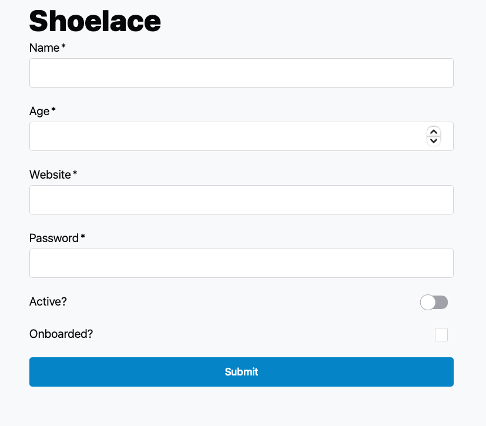
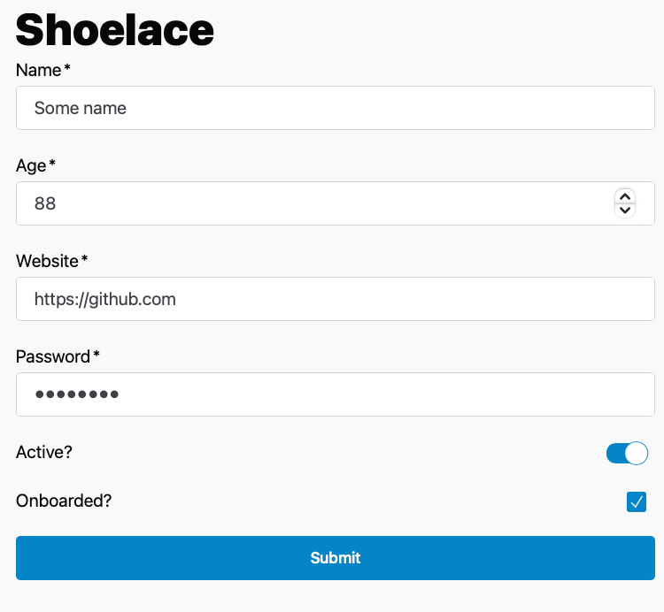
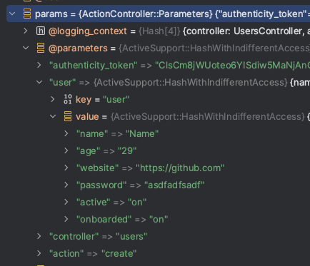

# Using Shoelace
https://github.com/material-components/material-web/blob/main/docs/quick-start.md

## How to
In a fresh Rails app using `jsbundling` and `esbuild`

**1. Install Shoelace components**
```bash
$ yarn add @shoelace-style/shoelace
```

**2. Add the stylesheet to application.html**
```js
// app/views/layouts/application.html.erb
<head>
    ...
    <link rel="stylesheet" href="https://cdn.jsdelivr.net/npm/@shoelace-style/shoelace@2.10.0/cdn/themes/light.css" />
</head>
```

**3. Copy the form builder in this folder to your app**
```
app/
  models/
  controllers/
  form_builders/
    shoelace_form_builder.rb
```

**4. Use the form builder in a form**
In any form in any page in your app, use the `builder` option.

This example assumes you have a `User` model with a `name` attribute but you can use whatever you want

```erb
<%= form_with model: User.new, builder: ShoelaceFormBuilder do %>
  <%= form.text_field :name %>
<% end %>
```

**5. Run the server**
```bash
$ bin/dev
```

**6. Visit the form**

In whichever location you used it.

## Preview





